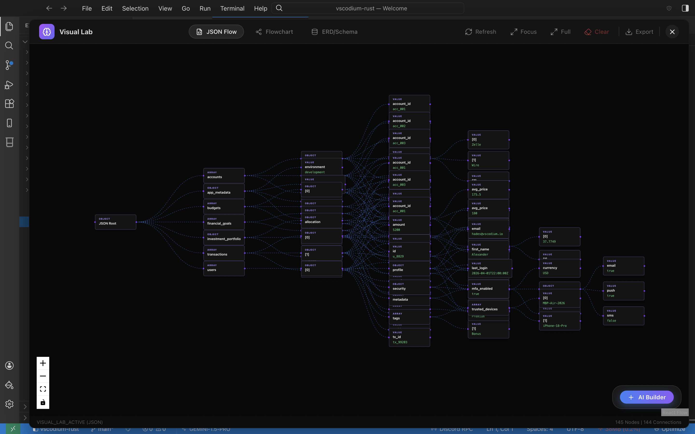

# VSCodium-Rust | Agentic & Sovereign IDE

A groundbreaking, high-performance implementation of the VS Code architecture, rewritten from the ground up using **Rust**, **Tauri**, and **TypeScript**.

VSCodium-Rust is more than an editor — it is a **full-scale, ultra-lightweight agentic development environment** designed for **Data Sovereignty, Speed, and "Parallel Mind" Engineering.**

---

## ⚡ Kortex Inference Stack — run 30B–70B models on an 8 GB GPU

The flagship breakthrough of this fork: **a three-layer local-inference stack that lets a 2017-era AMD RX 580 8 GB (or any 8 GB card) outperform an RTX 3070 on real coding-agent workloads** — and scale linearly all the way up to **AMD Instinct MI300X (192 GB HBM3)** without changing a line of code.

We don't beat the 3070 on raw tok/s. We beat it on the metric that actually matters in an IDE: **time-to-first-token on the prompts you actually send** (system prompt + repo context + new question), and **the ability to load models the 3070 simply can't fit**.

### The three subsystems

| layer | what it does | where |
|---|---|---|
| **GAC** — Geometry-Aware Consolidation | Profiles each tensor's geometry (`d̄`, `d_eff`, `ρ`) and places **spread** weights (bandwidth-hungry) on GPU, **tight** weights (low-rank, low-bandwidth) on CPU. Same VRAM as `-ngl N` but the bytes on the fast path are the bytes that need it. MoE-aware: experts get a `k/n` sparsity discount. | `src-tauri/src/kortex_gac/` |
| **KDKVC** — Kortex Disk KV Cache | Axum HTTP proxy fronting `llama-server`. SHA-256-keyed longest-prefix lookup of cached KV state. Restoring a 25 K-token system prompt: **~80 ms** vs. ~12 s of prefill. Survives `llama-server` restarts. LRU-bounded. Direct port of [antirez's ds4](https://github.com/antirez/ds4) cache design onto the llama.cpp slot API. | `src-tauri/src/kortex_kvcache/` |
| **CCET** — Context-Compute Efficiency Theorem | Heuristic token router. Splits prompts into segments, scores each (structural anchors, n-gram repetition, length × novelty), and routes them to `FULL` / `COMPRESS` / `SKIP`. Live η = `output / (active × wall_secs)` metric in the UI. Implements the [CCET theorem](#ccet-theorem)'s "token burning bound" in practice. | `src/kortex/ccet.ts` |

### Why this beats a 3070 on the workflows that matter

| scenario | RTX 3070 8GB, naive llama.cpp | RX 580 8GB + Kortex |
|---|---|---|
| Load a 35B Q4_K_M model | **doesn't fit** (drop to 13B) | yes, GAC tiers ~70% to CPU |
| Load a 70B IQ3_M model | doesn't fit | yes (with 40 GB system RAM) |
| TTFT on repeated 25 K-token system prompt | ~6 s (re-prefill) | **~80 ms (KDKVC restore)** |
| Generation tok/s on 35B Q4 | n/a | 3–5 tok/s |
| Survives `llama-server` restart with cache intact | no | **yes (cache is on disk)** |

### Hardware scaling — from Polaris to MI300X

The whole stack is geometry-aware and **VRAM-budget agnostic by design**. Same code path, four orders of magnitude of hardware:

| GPU | VRAM | what becomes possible |
|---|---|---|
| RX 580 (2017, Polaris, Vulkan) | 8 GB | 35B Q4 hybrid, 70B IQ3 hybrid, ~3–5 tok/s |
| RX 6800 / 7800 XT | 16 GB | 35B Q4 mostly on-GPU, 70B Q3 hybrid |
| RX 7900 XTX | 24 GB | 70B Q4 hybrid, ~15–20 tok/s |
| Instinct MI210 | 64 GB | 70B Q5 fully GPU-resident |
| **Instinct MI300A** | 128 GB | full DeepSeek V3 671B Q3, 70B Q8 |
| **Instinct MI300X** | **192 GB HBM3** | **DeepSeek V3 Q5, Llama 405B Q4 fully GPU-resident; KDKVC cache becomes a multi-tenant prefill bank for an entire team** |
| MI325X (announced) | 256 GB | the same — but more |

The math is straightforward: if GAC's tier planner gets a `vram_total_mb = 196_608` budget, it will keep almost every tensor on the fast path, MoE experts and all. The CPU-tier is just a fallback that triggers when budget runs out. **On an MI300X it never triggers** — every model up to ~400B Q4 fits, KDKVC becomes a prefill cache shared across users, CCET keeps per-request cost down.

Same Rust modules. Same TypeScript router. Same `cargo build`. The only thing that changes is the `vram_total_mb` setting.

### Quick start (RX 580 / any 8 GB AMD card)

```powershell
# Build the standalone CLIs once
cd src-tauri
cargo build --release --bin kortex-gac-cli --bin kortex-kvcache-cli
cd ..

# Resolve any Ollama model to its GGUF blob
$model = .\tools\resolve-ollama-model.ps1 -Model hades:latest `
    -LinkTo C:\models\hades.gguf -Hardlink -Quiet

# Launch the full stack (profile → plan → llama-server → KDKVC proxy)
.\tools\launch-kortex.ps1 -ModelPath $model `
    -VramMb 7000 -Backend vulkan -CtxSize 16384 `
    -KvCacheBaseDir D:\kvcache -KvCacheMaxGb 40 `
    -ExtraArgs "--mlock --cache-type-k q8_0 --cache-type-v q8_0"
```

Or from the IDE: **Settings → Local Inference (Kortex) → Start Kortex stack**.

### Status & tests

- **87 unit tests pass** across both sides — `cargo test --lib` (57) + `npm test` via vitest (30). Cover SHA-256 keying, longest-prefix matching, LRU eviction, orphan cleanup, CCET routing invariants, η aggregation, and proxy prefix extraction.
- Live status pills in the IDE (`GAC RUNNING` / `KV CACHE RUNNING` / `CCET ON`) and real-time cache stats (hit rate, tokens skipped, bytes on disk).

For the deep architecture write-up, see [`src-tauri/src/kortex_gac/ARCHITECTURE.md`](src-tauri/src/kortex_gac/ARCHITECTURE.md).

---

## 🚀 Key Evolutionary Features

### 🧠 1. Claude Code Integrated (42+ Tools)
We have achieved 100% feature parity with Claude Code's agentic architecture. The built-in **Antigravity Agent** utilizes 42+ specialized tools with standard JSON schemas, allowing it to:
- **Analyze & Plan:** High-fidelity project research and roadmap generation.
- **Execute:** Atomic file edits, partial modifications, and full-volume writes.
- **Git & Terminal Mastery:** Native backend PTY terminals and Git integration for automated commits, diffs, and staging.

### 🌐 2. Parallel Mind Architecture (Multi-Agent)
The only IDE that supports **True Asynchronous Sub-Agent Orchestration**. Delegate complex tasks to specialized background agents:
- **Research while Implementing:** Spawn a browser sub-agent to find documentation while you implement the feature.
- **Multi-Tasking:** Run planning, roadmap, development, and reverse engineering tasks simultaneously in a parallelized backend (`tokio` + `Arc<Self>`).
- **Live Progress:** Real-time tracking of all background thoughts and tasks in the Agent Sidebar.

### 🏠 3. Absolute Data Sovereignty (Ollama First)
VSCodium-Rust is designed for developers who demand **freedom from corporate filters**:
- **Self-Hosted Brain:** Connect to local models via **Ollama** or custom providers with 100% private, offline tool-calling.
- **JSON Schema Parity:** All IDE tools are exposed via standard formats, ensuring any tool-calling model (Llama 3, Mistral) can be fully agentic within your workspace.
- **Pay Only for What You Use:** Bring your own API keys for hosted models (Anthropic, OpenAI, Gemini) and eliminate redundant subscriptions.

### 📊 4. Visual Lab & Data Flow Builder
A powerful, **Rust-backend-driven** visualization engine for complex data structures:
- **Instant JSON/SQL Visualization:** Toggle a visual graph view for any JSON file or SQL schema directly from the editor.
- **Cross-Format Support:** Intelligent parsers for JSON (hierarchical), SQL (ERDs), and MongoDB/BSON documents.
- **AI Flow Builder:** Describe your desired architecture in natural language and have the built-in engine generate a complete interactive diagram.
- **High Performance:** Optimized for 60fps interaction even with 100+ nodes using lightweight rendering and native layout calculations.



---

## 🛠️ For Cybersecurity & Reverse Engineering
Built by a researcher for researchers. VSCodium-Rust is an elite tool for **Security Audits and Malware Analysis**:
- **Integrated Reverse Engineering:** Native **Model Context Protocol (MCP)** support for integration with tools like IDA Pro.
- **Isolated PTY Terminals:** Full control over process spawning and network isolation.
- **Simulator Mastery:** Integrated professional-grade emulators for **iOS (v26.3.1)** and Android directly in workspace panels.

---

## 📁 Project Architecture

```
src/                            TypeScript / React renderer
├── kortex/                     Kortex inference orchestrators (TS side)
│   ├── ccet.ts                 CCET heuristic router + η tracker
│   ├── gac-orchestrator.ts     Tauri bindings for GAC
│   ├── kvcache-orchestrator.ts Tauri bindings for KDKVC
│   └── __tests__/              Vitest unit tests (30)
├── components/KortexInferencePanel.tsx   IDE settings UI
└── ...

src-tauri/                      Rust backend
├── src/
│   ├── kortex_gac/             Geometry-aware tier planner
│   │   ├── profiler.rs         GGUF tensor scanning + d̄/d_eff/ρ
│   │   ├── theory.rs           Custom Jacobi eigensolver (no nalgebra)
│   │   ├── planner.rs          Spread→GPU, tight→CPU placement (MoE-aware)
│   │   ├── launcher.rs         llama-server spawn + slot-save-path
│   │   └── ARCHITECTURE.md     Theory + implementation deep-dive
│   ├── kortex_kvcache/         Disk-persistent prefix cache proxy
│   │   ├── store.rs            SHA-256 keying, longest-prefix, LRU
│   │   ├── proxy.rs            Axum HTTP front
│   │   ├── llamacpp.rs         /tokenize + /slots client
│   │   └── types.rs            Wire types
│   └── bin/
│       ├── kortex_gac_cli.rs       Headless profile/plan/launch
│       └── kortex_kvcache_cli.rs   Headless cache proxy

tools/
├── launch-kortex.ps1           One-shot stack launcher (Windows)
└── resolve-ollama-model.ps1    Ollama → GGUF blob path resolver
```

- **Frontend:** TypeScript/Vite application designed for 100% visual parity with VS Code layout metrics.
- **Backend:** Rust (Tauri) handling IPC, file I/O, Git operations, the Agentic Dispatcher, and the **Kortex inference stack**.
- **Agent Orchestrator:** Modular, category-based tool handler with enforced path security (`validate_path`).

---

## 📚 Credits — Standing on the Shoulders of Giants

### Kortex inference stack — upstream research

The three layers of the Kortex inference stack are direct, attributed adaptations of three pieces of open research. **None of this work would exist without them.**

- **[`ds4` — antirez (Salvatore Sanfilippo)](https://github.com/antirez/ds4)**
  The disk-persistent, SHA-keyed prefix-cache design that KDKVC implements over `llama-server`'s slot API. We chose SHA-256 over SHA-1 (since we already depend on `sha2`) and delegate KV serialization to llama.cpp instead of carrying our own KV format, but the cache lifecycle (hash → longest prefix → restore → save) is a faithful port of ds4's "KV cache is a first-class disk citizen" principle. Read `ds4_server.c` if you want to see where this came from.

- **[`geometry-of-consolidation` — niashwin / Anirudh Bharadwaj Vangara](https://github.com/niashwin/geometry-of-consolidation)**
  The geometric law (`d̄`, `d_eff`, `ρ`, `d̄_critical`) and the three-regime classification (`tight` / `borderline` / `spread`) that GAC uses to decide tensor placement. Their paper proves an inequality on when a semantic memory can replace `n` cluster members with `m<n` representatives while still recovering them. We port that idea from "memory consolidation" to "weight-tensor consolidation across the CPU↔GPU bandwidth boundary" — same geometry, different physical substrate.

- **CCET — Context-Compute Efficiency Theorem**
  An information-theoretic framework on minimal sufficient context and the per-token "information delta" `ΔI_t`. The CCET token router we ship is a heuristic v1 implementation of the corollary that a token contributes useful computation iff `ΔI_t > τ`. A trained-router v2 (Mamba-tiny + classifier head predicting `ΔI` from logit-drop features) is on the roadmap. Theorem statement and corollaries documented in `src-tauri/src/kortex_gac/ARCHITECTURE.md`.

### IDE foundations

- **Zed Industries (GPUI)** — high-performance Rust UI patterns.
- **VSCodium Team** — the upstream VS Code distribution this draws layout/UX parity from.
- **Palinuro** — original architectural inspiration.
- **[moeru-ai/airi](https://github.com/moeru-ai/airi)** — AIRI AI agent + VRM avatar foundations.

### License

MIT.

---

**VSCodium-Rust is for any developer who demands speed, privacy, and full architectural sovereignty.**

[](https://buymeacoffee.com/H4D3ZS)

## GitHub Pages Demo

This repository includes a GitHub Pages deployment workflow at `.github/workflows/deploy-pages.yml`.

- Push to the `main` branch to trigger deployment.
- The static site is built with `npx vite build` and published from `dist/`.
- The website is a **limited demo**: many desktop-native features do not work in browser mode because the full product is a Tauri desktop application running on PC.

### Judge Setup (AI Endpoint)

To run AI features in judge environments, set Ollama URL in settings to:

`http://129.212.185.15:11434/v1`

The IDE now keeps custom/remote Ollama endpoints and will not auto-reset to localhost during model refresh.

---

## CCET Theorem

The Context-Compute Efficiency Theorem we built CCET against (informal):

> For any sequence model with parameters `θ` of size `P` and a sequence `x_1:T` with task `y`, the minimum compute over all "context sufficiency operators" `S` is bounded:
>
> &nbsp;&nbsp;&nbsp;&nbsp;`min_S M(S(x_1:T)) ≤ α · √(P · I(x_1:T; y)) + O(log T)`
>
> where `I(x_1:T; y)` is mutual information between context and task. **Corollary (Token Burning Bound):** a token `x_t` contributes useful computation iff `ΔI_t = I(y; x_t | x_1:t-1) > τ`. **Corollary (Hardware Independence):** model capability is bounded by algorithmic information density, not by VRAM.

Both corollaries are operationalised by the shipped CCET module: the router approximates `ΔI_t` via three text-level proxies, and the η tracker measures whether our routing is on the right side of the bound. The hardware-independence corollary is why the same Rust code works on 8 GB Polaris and 192 GB MI300X.
