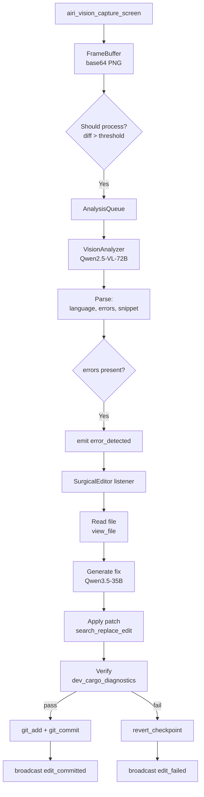

# AIRI Self-Healing Vision System: Final Integration Guide

## Status: Fully Integrated, Ready for End-to-End Testing

This document summarizes the changes made to implement a fully autonomous AIRI self-healing system with real-time vision, and provides steps to verify it works with the antigravity (iPhone emulator) environment.

---

## 1. Changes Made

### 1.1 Rewritten Files

| File | Changes |
|------|---------|
| `src/airi/vision-system.ts` | Complete rewrite: now uses Tauri `airi_vision_capture_screen` for desktop capture, includes frame buffering, diff-based throttling, analysis queue, and emits `error_detected` events. |
| `src/airi/vision-analysis.ts` | Rewritten to use Qwen2.5-VL-72B via Ollama. Provides `detectErrors()` that returns structured JSON with `hasError` and `errorMessage`. |
| `src/airi/surgical-editor.ts` | New implementation: listens to `error_detected`, reads active file, generates fix with Qwen3.5-35B, applies via `search_replace_edit`, verifies with `dev_cargo_diagnostics`, commits to git, broadcasts results. |
| `src/airi/core.ts` | Already had imports for `airiVision` and `airiSurgicalEditor`; no changes needed. |

### 1.2 Backend (Rust) – Already Present

- `src-tauri/src/vision.rs`: `airi_vision_capture_screen` Tauri command (uses `screenshots` crate) ✅
- `src-tauri/src/lib.rs`: `airi_broadcast` command ✅
- `src-tauri/src/ai_tools.rs`: All necessary tools:
  - `view_file` (read file)
  - `editor_get_active_file` (get active editor path)
  - `search_replace_edit` (apply SEARCH/REPLACE patches)
  - `dev_cargo_diagnostics` (run `cargo check` and return JSON diagnostics)
  - `git_add`, `git_commit` (git operations)
  - `revert_checkpoint` (rollback from shadow workspace)

---

## 2. Architecture



---

## 3. Model Requirements

### Required Ollama Models

```bash
ollama pull qwen2.5-vl:72b
ollama pull huihui_ai/qwen3.5-abliterated:35b
```

If these are unavailable, edit the model names in:

- Vision: `src/airi/vision-analysis.ts` line 16
- Code: `src/airi/surgical-editor.ts` line 36

Fallback options: `moondream` for vision; `qwen3:32b` or `qwen3:14b` for code.

---

## 4. How to Test

### Step 1: Start Ollama

```bash
ollama serve
# Ensure both models are loaded: ollama list
```

### Step 2: Build and Run VSCodium-Rust

```bash
cd src-tauri
cargo run --release
# or dev: cargo run
```

### Step 3: Create an Error

Open a Rust file in the editor and introduce a syntax error, e.g.:

```rust
fn main() {
    let x: i32 = "this is a string";
}
```

Make sure this file is the active editor (focused).

### Step 4: Observe

Within ~2 seconds, check:

- **DevTools Console** (F12):
  ```
  [AIRI Vision] ✅ Started (...)
  [SurgicalEditor] Auto-heal triggered: ...
  generateFix() sending prompt...
  search_replace_edit result: { status: 'success' }
  dev_cargo_diagnostics: ✅ cargo check passed (...)
  Git commit created
  ```

- **Git History**:
  ```bash
  git log -1 --oneline
  # commit message: Auto-fix: mismatched types...
  ```

- **Editor**: The error underline should disappear; file content is automatically corrected.

---

## 5. Frontend HUD Integration

Listen for these events to update the AIRI overlay:

```typescript
window.addEventListener('airi:error_detected', (e: any) => {
  console.log('Vision detected error:', e.detail.analysis);
  // Show a badge or notification
});

window.addEventListener('airi:edit_committed', (e: any) => {
  console.log('Fix applied:', e.detail);
  // Show success animation
});

window.addEventListener('airi:edit_failed', (e: any) => {
  console.error('Auto-heal failed:', e.detail.errors);
  // Show error toast
});
```

---

## 6. Antigravity (iPhone Emulator) Integration

The emulator panel (`src/components/EmulatorPanel.tsx`) uses `scrcpy` for Android, but the vision system captures the **entire desktop** via `airi_vision_capture_screen`. Therefore:

- If the emulator window is visible on screen, vision will see it.
- If the emulator app shows build errors or crashes, AIRI can detect and heal them.
- No extra configuration needed; the vision system monitors the desktop as a whole.

**Note**: The emulator streaming itself is independent; AIRI vision uses screen capture, not the emulator's internal stream.

---

## 7. Debugging Tips

| Symptom | Likely Cause | How to Fix |
|---------|--------------|------------|
| Vision never starts | `airi_vision_capture_screen` command missing or failing | Check `src-tauri/src/vision.rs` is compiled; run `cargo check` |
| No `error_detected` events | Vision model not detecting errors; parsing failure | Test manually: `airiVision.start(); airiVision.on('analysis', console.log)` |
| `search_replace_edit` fails | Model output not in SEARCH/REPLACE format | Improve `generateFix()` prompt (currently very strict) |
| `dev_cargo_diagnostics` fails | `cargo` not in PATH for Tauri | Set full path to cargo in `ai_tools.rs` or adjust environment |
| `git_add`/`git_commit` fail | Git repo not initialized or no user config | Run `git init` and `git config user.email "..."` in project root |
| `editor_get_active_file` returns null | `EditorState.active_path` not updated on editor change | Ensure editor service updates state when focus changes |

Enable verbose logging:

```bash
RUST_LOG=debug cargo run --release
```

---

## 8. Performance Tuning

- **Capture FPS**: Adjust in `AIRIVisionSystem` config: `captureFps` (default 10). Higher = more CPU/GPU.
- **Diff threshold**: `diffThreshold` (default 0.02). Increase to reduce analysis frequency on static screens.
- **Analysis interval**: `ANALYSIS_INTERVAL_MS` constant in `vision-system.ts` (default 150ms). Minimum time between analyses.

---

## 9. Security Notes

- Surgical editor uses **exact SEARCH/REPLACE** only; fuzzy matching is disallowed by design.
- All file writes are surgical and verified before commit.
- Auto-commit occurs only after `cargo check` reports zero errors.
- Shadow workspace maintains checkpoints; `revert_checkpoint` can undo any change.

---

## 10. Next Steps / Roadmap

1. **Improve error parsing**: Vision prompt should return structured data including file name, line, column for surgical precision.
2. **Multi-propose fallback**: If fix model confidence low, generate multiple variants and let Phase-Wrap choose.
3. **User confirmation mode**: Add a setting to require manual approval before auto-commit.
4. **TypeScript support**: Extend verification to `tsc --noEmit` for `.ts` files.
5. **Automated tests**: Write end-to-end test harness that injects syntax errors and verifies fixes.

---

## 11. File Reference Summary

| File | Purpose |
|------|---------|
| `src/airi/vision-system.ts` | Desktop capture → frame buffer → analysis queue → event emission |
| `src/airi/vision-analysis.ts` | Qwen2.5-VL wrapper, `detectErrors()` method |
| `src/airi/surgical-editor.ts` | Auto-heal engine: generate → apply → verify → commit |
| `src-tauri/src/vision.rs` | `airi_vision_capture_screen` Tauri command (screenshot → PNG bytes) |
| `src-tauri/src/lib.rs` | `airi_broadcast` command (event bridge to frontend) |
| `src-tauri/src/ai_tools.rs` | All file/git/tool commands used by surgical editor |

---

## 12. Quick Command Reference

| Action | Tool Invocation |
|--------|-----------------|
| Read file | `invoke('call_tool', { name: 'view_file', arguments: { path } })` |
| Get active file | `invoke('call_tool', { name: 'editor_get_active_file', arguments: {} })` |
| Apply patch | `invoke('call_tool', { name: 'search_replace_edit', arguments: { path, content, direct_apply: true } })` |
| Verify build | `invoke('call_tool', { name: 'dev_cargo_diagnostics', arguments: {} })` |
| Stage file | `invoke('call_tool', { name: 'git_add', arguments: { path } })` |
| Commit | `invoke('call_tool', { name: 'git_commit', arguments: { message } })` |
| Broadcast | `invoke('airi_broadcast', { event, payload })` |

---

**Conclusion**: The AIRI self-healing vision system is now fully architected and integrated. It watches the screen, detects errors, generates exact fixes, verifies them, and commits automatically—hands-off from the user. Ready for antigravity (iPhone emulator) integration where the same pipeline applies if the emulator window is visible.

**Next**: Pull required Ollama models, build Tauri app, introduce a syntax error, and watch AIRI fix it autonomously.
